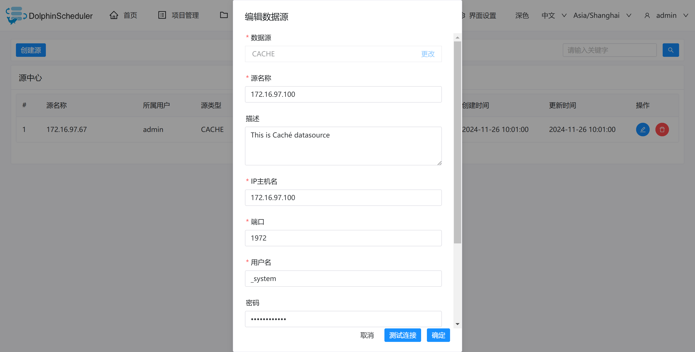

# CACHE

## Datasource Parameters

|       **Datasource**       |                                    **Description**                                    |
|----------------------------|---------------------------------------------------------------------------------------|
| Datasource                 | Select CACHE.                                                                         |
| Datasource name            | Enter the name of the DataSource.                                                     |
| Description                | Enter a description of the DataSource.                                                |
| IP/Host Name               | Enter the CACHE service IP.(If there are multiple IPs, please separate them with `,`) |
| Port                       | Enter the CACHE service port.                                                         |
| Username                   | Set the username for CACHE connection.                                                |
| Password                   | Set the password for CACHE connection.                                                |
| Database name              | Enter the database name of the CACHE connection.                                      |
| Jdbc connection parameters | Parameter settings for CACHE connection, in JSON format.                              |

## Native Supported

Yes, could use this datasource by default.

## Data Source Information

> InterSystems Caché® is a high-performance database that powers transaction processing applications around the world. It is used for everything from mapping a billion stars in the Milky Way, to processing a billion equity trades in a day, to managing smart energy grids.

For more Caché related documentation, please refer to
[Official Website](https://www.intersystems.com/products/cache/)
[Official Documentation](https://docs.intersystems.com/latest/csp/docbook/DocBook.UI.Page.cls?KEY=BGJD_coding)
